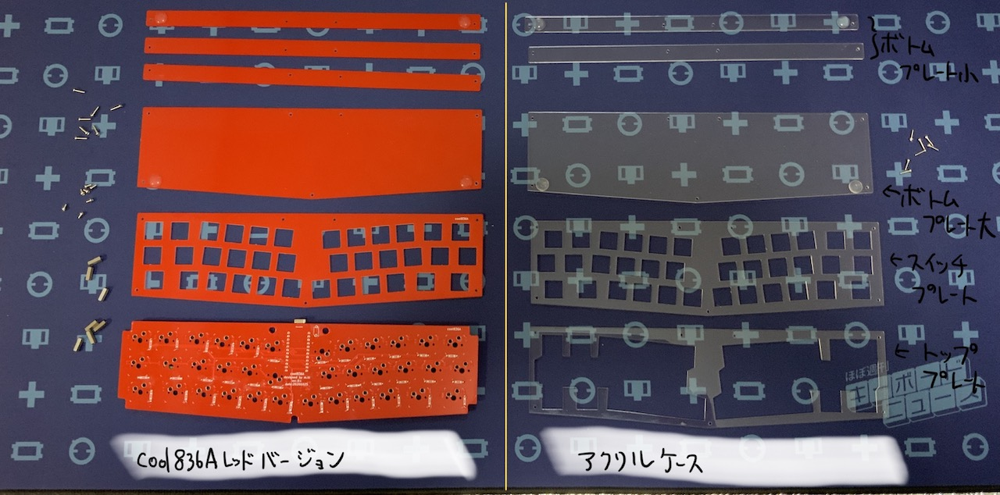

# アクリルケース換装の手順
 

**写真**

 

 
　本品は、m.kiが頒布している自作キーボドキット「cool836Aレッドバージョン」用のアクリルケースです。本品には、PCB等が含まれていません。
すでに、cool836Aレッドバージョンをお持ちの方が対象となります。なお、cool836Aブラックバージョンをお持ちの方は、組み立て前であれば、
トッププレート等と本品と交換して使用することが可能です。組み立て後であれば、一度、PCBにハンダ付けされたスイッチを取り外す手間があります。
本品は、レッドバージョン以降に、実装されたLEDの透過のために設計されたものであります。LED実装のないブラックバージョンには不向きと考えています。
なお、cool836AにおけるLEDはオプションです。別途購入が必要となります。
cool836Aイエローバージョンとの互換性は未確認です。
 

**同封されている部品**
１　トッププレート　１枚
２　スイッチプレート　１枚
３　ボトムプレート大　１枚
４　ボトムプレート小　２枚
５　M２ネジ（８mm）　７本
６　クッションゴム　４個
 

**換装の手順**
１　レッドバージョンのネジを外して、部品ごとに分けてください。次の写真では、比較できるよう並べました。 

使うのは、次の写真にある部品です。 

２　アクリルのトッププレートとスイッチプレートを重ねて、トッププレート側からM２ネジ（８mm　※本品では８mmしか使用しません。レッドバージョン付属の４mmは不要となります。）を差し込み、
反対側にM２スペーサーで固定します。 

３　２でできたものにレッドバージョンPCBに重ねます。重ねたら、キースイッチをはめていってください。（写真ではキーキャップまではめた後の写真です。） 

４　３の向きを逆さにして、ボトムプレート大、小を重ね、M２ネジで固定してください。クッションゴムを取り付ければ、完成です。（写真では、先に取り付けてあります。） 

気に入って頂ければ、幸いです。

